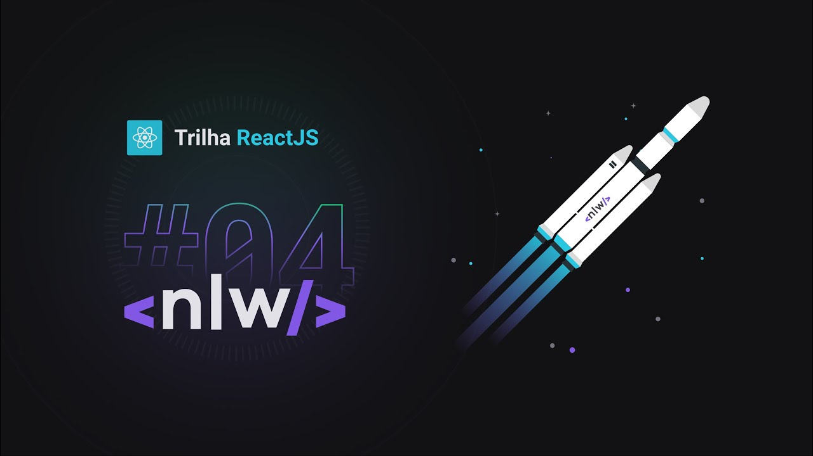

<h1  align="center">NPS-NLW</h1>

  

<a  href="#-technologies">Technologies</a>&nbsp;&nbsp;&nbsp;|&nbsp;&nbsp;&nbsp;
<a  href="#-project">Project</a>&nbsp;&nbsp;&nbsp;|&nbsp;&nbsp;&nbsp;
<a  href="#-diagram">Diagram</a>&nbsp;&nbsp;&nbsp;|&nbsp;&nbsp;&nbsp;
<a  href="#-how-to-run">How to run</a>&nbsp;&nbsp;&nbsp;|&nbsp;&nbsp;&nbsp;
<a  href="#-licence">Licence</a>

  

 

 
  

## ✨ Technologies

  

This project was developed with the following technologies:

  

- [TypeScript](https://www.typescriptlang.org/)

- [Ethereal-Email](https://ethereal.email/)

- [TypeORM](https://typeorm.io/#/)

- [Express](https://expressjs.com/pt-br/)

- [Jest](https://jestjs.io/)

- [SQL Editor Beekeeper Studio](https://www.beekeeperstudio.io/)

  

## 💻 Project

  
NPS-NLW is part of “Next Level Week # 4 - Node.js Route”, an intensive week of programming promoted by RocketSeat and taught by Daniele Evangelista. This application consists of calculating the company's NPS. In it we register users, register surveys, send e-mail to users to answer satisfaction surveys and with this we can perform the NPS calculation.

We learned concepts about what an API is, how to start a project using Typescript and Express for route management, TypeORM for data manipulation, automated tests and sending e-mail.

  

## 🔶 Diagram

  

  

## 🚀 How to run

  

- Clone the repository

- Install dependencies with `yarn`

- Start the server with `yarn dev`

  

The application can be accessed at [`localhost:3333`](http://localhost:3333).

  

## 📄 Licence

  

This project is licensed under the GNU General Public License v3.0 - see the [LICENSE](LICENSE) file for details.

  

---

  

Made by Welton Leite 👋 [See my linkedin](https://www.linkedin.com/in/welton-leite-b3492985/)
